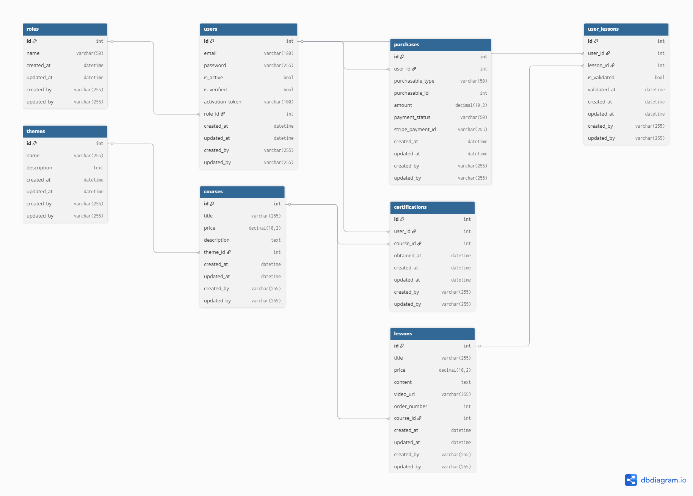

# Documentation du projet Knowledge Learning

## Architecture du projet

### Structure MVC
knowledge-learning/
├── src/
│ ├── Controller/ # Contrôleurs
│ ├── Entity/ # Entités Doctrine (Modèle)
│ ├── Repository/ # Accès aux données (DAO)
│ ├── Service/ # Services métier
│ ├── Form/ # Formulaires
│ └── Security/ # Sécurité
├── templates/ # Vues Twig
├── config/ # Configuration
├── public/ # Fichiers publics
│ └── images/ # Logo, Favicon, Diagramme DB
├── tests/ # Tests unitaires
├── docs/ # Documentation
└── README.md # Guide d'installation


---

## Base de données

### Modèle physique (Méthode Merise)

#### Entités principales

**1. User (Utilisateur)**
| Champ            | Type         | Description          |
|------------------|--------------|----------------------|
| id               | INT          | Identifiant unique   |
| email            | VARCHAR(180) | Email unique         |
| password         | VARCHAR(255) | Mot de passe hashé   |
| is_active        | BOOLEAN      | Compte activé ou non |
| is_verified      | BOOLEAN      | Email vérifié ou non |
| activation_token | VARCHAR(100) | Token d'activation   |
| role_id          | INT (FK)     | Référence au rôle    |
| created_at       | DATETIME     | Date de création     | 
| updated_at       | DATETIME     | Date de mise à jour  |

**2. Role (Rôle)**
| Champ      | Type        | Description         |
|------------|-------------|---------------------|
| id         | INT         | Identifiant unique  |
| name       | VARCHAR(50) | admin / client      |
| created_at | DATETIME    | Date de création    |
| updated_at | DATETIME    | Date de mise à jour |

**3. Theme (Thème)**
| Champ       | Type         | Description          |
|-------------|--------------|----------------------|
| id          | INT          | Identifiant unique   |
| name        | VARCHAR(255) | Nom du thème         |
| description | TEXT         | Description du thème |

**4. Course (Cursus)**
| Champ       | Type          | Description        |
|-------------|---------------|--------------------|
| id          | INT           | Identifiant unique |
| title       | VARCHAR(255)  | Titre du cursus    |
| price       | DECIMAL(10,2) | Prix en euros      |
| description | TEXT          | Description        |
| theme_id    | INT (FK)      | Thème associé      |

**5. Lesson (Leçon)**
| Champ        | Type          | Description           |
|--------------|---------------|-----------------------|
| id           | INT           | Identifiant unique    |
| title        | VARCHAR(255)  | Titre de la leçon     |
| price        | DECIMAL(10,2) | Prix en euros         |
| content      | TEXT          | Contenu (Lorem Ipsum) |
| video_url    | VARCHAR(255)  | Lien vidéo            |
| order_number | INT           | Numéro d'ordre        |
| course_id    | INT (FK)      | Cursus associé        |

**6. Purchase (Achat)**
| Champ             | Type          | Description          |
|-------------------|---------------|----------------------|
| id                | INT           | Identifiant unique   |
| user_id           | INT (FK)      | Utilisateur          |
| purchasable_type  | VARCHAR(50)   | type (course/lesson) |
| purchasable_id    | INT           | ID de l'item         |
| amount            | DECIMAL(10,2) | Montant payé         |
| payment_status    | VARCHAR(50)   | pending/paid/failed  |
| stripe_payment_id | VARCHAR(255)  | ID Stripe            |

**7. UserLesson (Validation)**
| Champ        | Type     | Description        |
|--------------|----------|--------------------|
| id           | INT      | Identifiant unique |
| user_id      | INT (FK) | Utilisateur        |
| lesson_id    | INT (FK) | Leçon validée      |
| is_validated | BOOLEAN  | Validée ou non     |
| validated_at | DATETIME | Date de validation |

**8. Certification**
| Champ       | Type     | Description        |
|-------------|----------|--------------------|
| id          | INT      | Identifiant unique |
| user_id     | INT (FK) | Utilisateur        |
| course_id   | INT (FK) | Cursus certifié    |
| obtained_at | DATETIME | Date d'obtention   |

### Relations

- users.role_id → roles.id
- courses.theme_id → themes.id
- lessons.course_id → courses.id
- purchases.user_id → users.id
- user_lessons.user_id → users.id
- user_lessons.lesson_id → lessons.id
- certifications.user_id → users.id
- certifications.course_id → courses.id

---

## Diagramme de la base de données



---

## Composants d'accès aux données (DAO)

| Repository              | Entity        | Rôle                       |
|-------------------------|---------------|----------------------------|
| UserRepository          | User          | Gestion des utilisateurs   |
| RoleRepository          | Role          | Gestion des rôles          |
| ThemeRepository         | Theme         | Gestion des thèmes         |
| CourseRepository        | Course        | Gestion des cursus         |
| LessonRepository        | Lesson        | Gestion des leçons         |
| PurchaseRepository      | Purchase      | Gestion des achats         |
| UserLessonRepository    | UserLesson    | Gestion des validations    |
| CertificationRepository | Certification | Gestion des certifications |

---

## Composants E-commerce (Stripe)

### Service: `src/Service/StripeService.php`

**Fonctionnalités:**
- Création de session de paiement Stripe Checkout
- Mode Sandbox (test)
- Gestion des métadonnées

### Controller: `src/Controller/PaymentController.php`

**Routes:**
- `POST /checkout/{type}/{id}` - Créer une session
- `GET /checkout/success/{type}/{id}` - Succès paiement
- `GET /checkout/cancel` - Annulation paiement

---

## Sécurité

| Mesure          | Description                                 |
|-----------------|---------------------------------------------|
| CSRF Protection | Middleware sur tous les formulaires         |
| Mots de passe   | Hashés avec Bcrypt                          |
| Validation      | 8 caractères, majuscule, minuscule, chiffre |
| Activation      | Token généré aléatoirement (32 bytes)       |
| Rôles           | Admin / Client avec hiérarchie              |

---

## Tests unitaires

### Tests réalisés (PHPUnit)

| Test         | Fichier                    | Description        |
|--------------|----------------------------|--------------------|
| Registration | RegistrationControllerTest | Création de compte |
| Login        | SecurityControllerTest     | Connexion          |
| Achat        | PaymentControllerTest      | Achat de cursus    |
| DAO          | UserRepositoryTest         | Accès aux données  |

### Exécution

```bash
vendor/bin/phpunit
Résultat:

text
OK (6 tests, 12 assertions)

Routes principales
Route	Controller	Description
/	HomeController	Page d'accueil
/register	RegistrationController	Inscription
/login	SecurityController	Connexion
/logout	SecurityController	Déconnexion
/verify/email	RegistrationController	Validation email
/course/{id}	CourseController	Détail cursus
/lesson/{id}	LessonController	Détail leçon
/lesson/{id}/validate	LessonController	Valider leçon
/certifications	CertificationController	Certifications
/checkout/{type}/{id}	PaymentController	Paiement
/admin	AdminController	Dashboard admin
Identité graphique
Élément	Description
Police	Comic Sans MS
Couleurs	#f1f8fc, #00497c, #0074c7, #384050, #cd2c2e, #82b864
Logo	Logo Knowledge Learning
Favicon	Favicon Knowledge Learning
Technologies utilisées
Technologie	Version	Utilisation
Symfony	8.1	Framework principal
Doctrine ORM	3.0	ORM
MySQL	8.0	Base de données
Twig	3.0	Template engine
Stripe API	20.3	Paiements
PHPUnit	13.2	Tests unitaires
Mailtrap	-	Email sandbox
Conclusion
Le projet Knowledge Learning est une plateforme e-learning/e-commerce complète qui répond à l'ensemble des fonctionnalités demandées dans le cahier des charges.

text

---

## 📁 ÉTAPE 6: METTRE À JOUR LE README.md

```bash
code README.md
markdown
# 📚 Knowledge Learning - Plateforme E-learning

## Description
Knowledge Learning est une plateforme e-learning/e-commerce développée avec Symfony 8.1.

## Prérequis
- PHP 8.1+
- Composer
- MySQL 8.0+
- Symfony CLI
- Compte Stripe (sandbox)
- Compte Mailtrap

## Installation

```bash
git clone https://github.com/DsRiri/knowledge-learning.git
cd knowledge-learning
composer install
php bin/console doctrine:database:create
php bin/console doctrine:schema:update --force
php bin/console doctrine:fixtures:load
symfony server:start
Compte admin
Email: admin@knowledge.com

Mot de passe: Admin123!

Fonctionnalités
✅ Inscription et activation par email (Mailtrap)

✅ Authentification sécurisée

✅ Achat de cursus et leçons (Stripe)

✅ Validation des leçons

✅ Certifications automatiques

✅ Interface responsive

Tests
bash
vendor/bin/phpunit
Technologies
Symfony 8.1

Doctrine ORM

MySQL

Twig

Stripe API

PHPUnit

text

---

## 📁 ÉTAPE 7: CRÉER LE DIAGRAMME DB (PNG)

Va sur https://dbdiagram.io/d, crée le schéma et exporte en PNG dans `public/images/db_diagram.png`

---

## 📁 ÉTAPE 8: GITHUB

```bash
git add .
git commit -m "Documentation complete - Knowledge Learning"
git push -u origin main